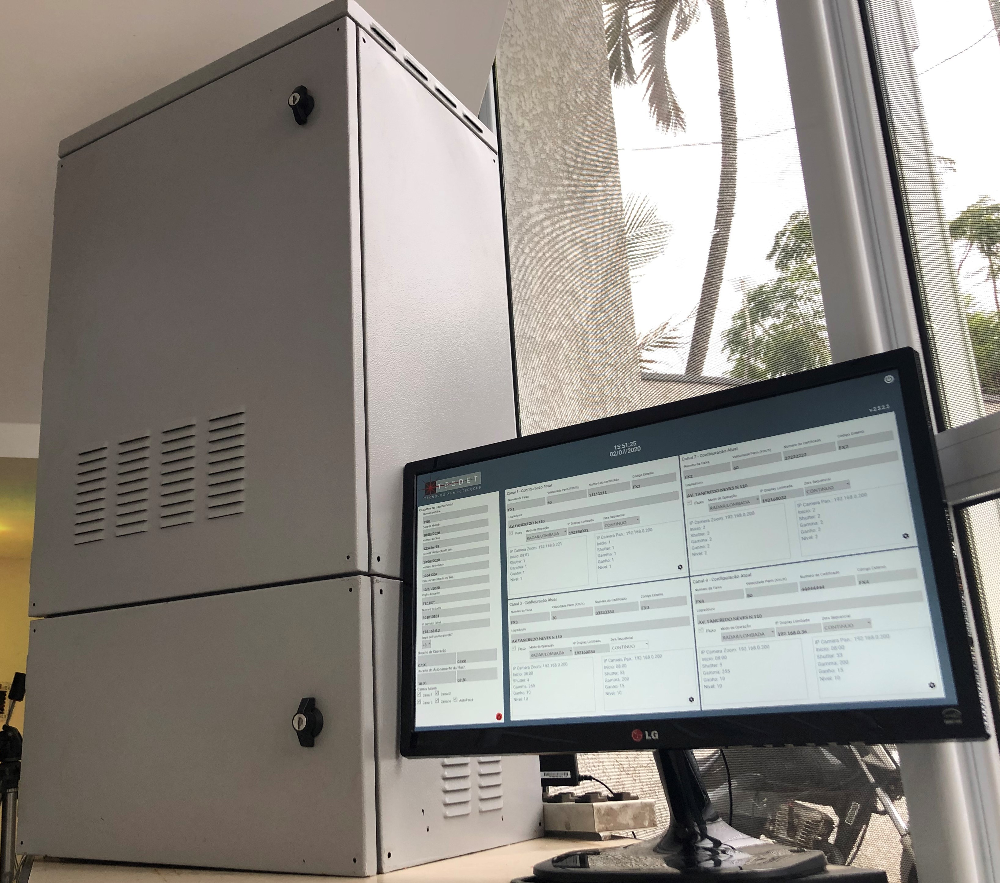

Why Tecdet decided to migrate your embedded system to Linux Arm and how they built an innovative way to inspect the Brazilian automotive traffic.
Tecdet develops systems for traffic control and inspection for the Brazilian government. Their engineers wanted to upgrade technology which was based on Windows x86, which was no longer satisfactory in terms of performance and energy consumption. They decided to rebuild their system for the Linux Arm architecture compatible with Toradex modules and chose TotalCross to develop their GUI.

## Why did Tecdet choose TotalCross to create their embedded project? 

### 1. Time to market
The project lead engineer had previous experience with firmware development, but no experience in GUI creation. TotalCross was **the fastest framework for him to learn and build the GUI he needed.** With his previous basic knowledge of Java, it took him one week to learn how to code with TotalCross and another two weeks to build the first version of the project with 5 screens running on the target device. That meant **more than 60% in time reduction**, as they had estimated 4 weeks to learn an alternative GUI (based in C and C++) framework and 4 more weeks to build the first version of the application.
### 2. Cost (hardware and GUI toolkit license)
Due to budget constraints, this project uses **low-end devices** and the company wanted to avoid runtime fees.
TotalCross met this requirement because of its **free and open source license** (with no developer seat charges or runtime fees) and it runs with **high performance in low-end** devices.
### 3. Low footprint
Running on low-end devices requires a low footprint. **TotalCross runtime** at that time was **5MB** (it has improved since then) and the **whole application**, including the custom Yocto Distro developed by [O.S. Systems](https://www.ossystems.com.br/) (TotalCross partner), has only **23MB**. 

## Embedded systems for society’s demands
Just like the Tecdet project, there are so many society’s demands which can be solved with good embedded projects. In cases like this, it’s important to analyse, mainly, the budget available and time to market expectations. In addition, projects for the government often require maintenance, that’s why having an easier and faster to learn framework is a highlight point to be considered. 
